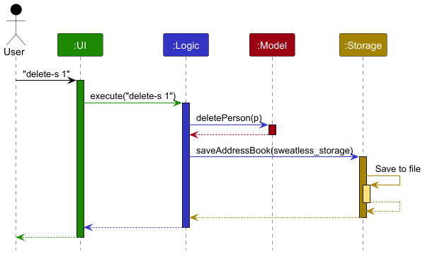
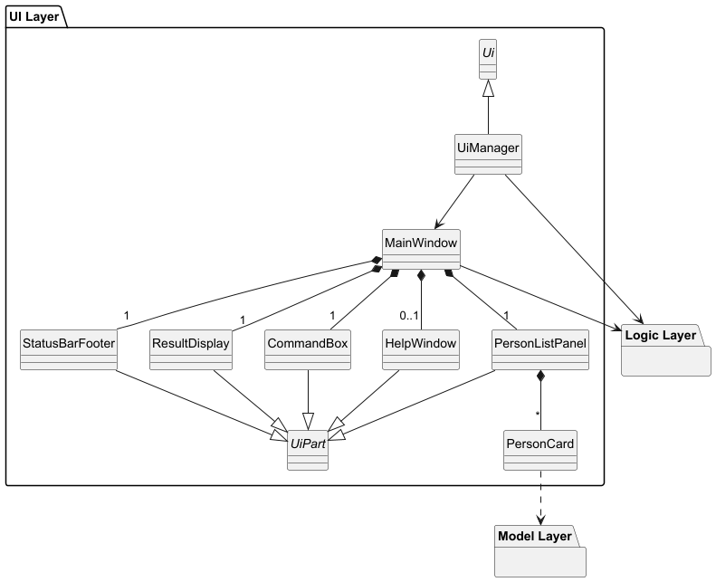
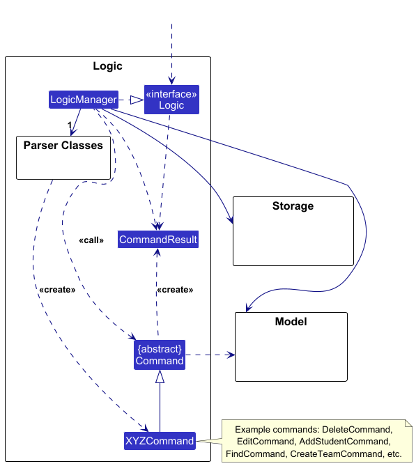
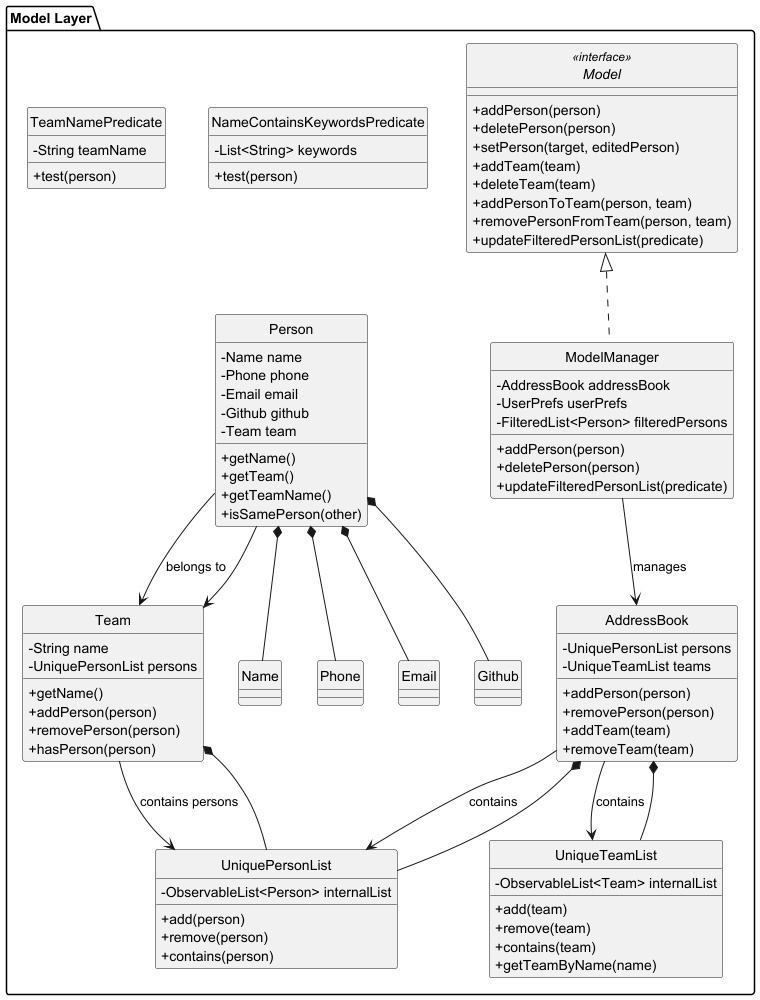
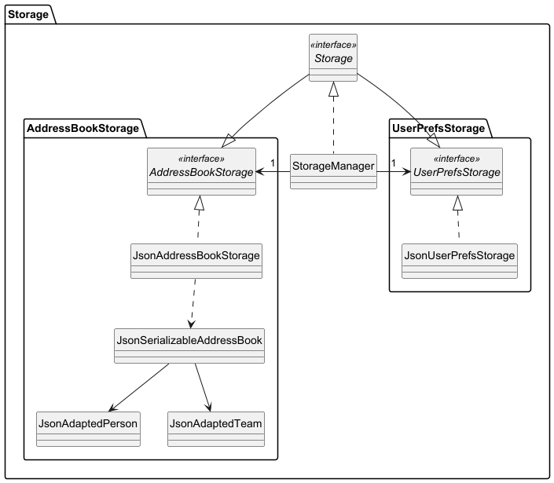

* Table of Contents
{:toc}

---

## **Acknowledgements**

- This project is based on the AddressBook-Level3 project created by the [SE-EDU initiative](https://se-education.org/)

---

## **Setting up, getting started**

Refer to the guide [_Setting up and getting started_](SettingUp.md).

---

## **Design**

### Architecture

The **_Architecture Diagram_** given above explains the high-level design of the App.

Given below is a quick overview of main components and how they interact with each other.

**Main components of the architecture**

**`Main`** (consisting of classes [`Main`](https://github.com/se-edu/addressbook-level3/tree/master/src/main/java/seedu/address/Main.java) and [`MainApp`](https://github.com/se-edu/addressbook-level3/tree/master/src/main/java/seedu/address/MainApp.java)) is in charge of the app launch and shut down.

- At app launch, it initializes the other components in the correct sequence, and connects them up with each other.
- At shut down, it shuts down the other components and invokes cleanup methods where necessary.

The bulk of the app's work is done by the following four components:

- [**`UI`**](#ui-component): The UI of the App.
- [**`Logic`**](#logic-component): The command executor.
- [**`Model`**](#model-component): Holds the data of the App in memory.
- [**`Storage`**](#storage-component): Reads data from, and writes data to, the hard disk.

[**`Commons`**](#common-classes) represents a collection of classes used by multiple other components.

**How the architecture components interact with each other**

The _Sequence Diagram_ below shows how the components interact with each other for the scenario where the user issues the command `delete-s 1`.

Each of the four main components (also shown in the diagram above),

- defines its _API_ in an `interface` with the same name as the Component.
- implements its functionality using a concrete `{Component Name}Manager` class (which follows the corresponding API `interface` mentioned in the previous point.

For example, the `Logic` component defines its API in the `Logic.java` interface and implements its functionality using the `LogicManager.java` class which follows the `Logic` interface. Other components interact with a given component through its interface rather than the concrete class (reason: to prevent outside component's being coupled to the implementation of a component), as illustrated in the (partial) class diagram below.

The sections below give more details of each component.

### UI component

The **API** of this component is specified in [`Ui.java`](https://github.com/se-edu/addressbook-level3/tree/master/src/main/java/seedu/address/ui/Ui.java)

The UI consists of a `MainWindow` that is made up of parts e.g.`CommandBox`, `ResultDisplay`, `PersonListPanel`, `StatusBarFooter` etc. All these, including the `MainWindow`, inherit from the abstract `UiPart` class which captures the commonalities between classes that represent parts of the visible GUI.

The `UI` component uses the JavaFx UI framework. The layout of these UI parts are defined in matching `.fxml` files that are in the `src/main/resources/view` folder. For example, the layout of the [`MainWindow`](https://github.com/se-edu/addressbook-level3/tree/master/src/main/java/seedu/address/ui/MainWindow.java) is specified in [`MainWindow.fxml`](https://github.com/se-edu/addressbook-level3/tree/master/src/main/resources/view/MainWindow.fxml)

The `UI` component,

- executes user commands using the `Logic` component.
- listens for changes to `Model` data so that the UI can be updated with the modified data.
- keeps a reference to the `Logic` component, because the `UI` relies on the `Logic` to execute commands.
- depends on some classes in the `Model` component, as it displays `Person` object residing in the `Model`.

#### Implemented UI Features

- Main window composed of:
    - `CommandBox` for entering commands
    - `ResultDisplay` for feedback messages (errors highlighted)
    - `PersonListPanel` that renders a scrollable list of students (`PersonCard` per student)
    - `StatusBarFooter` (e.g., file path and sync time)
- Live list updates: `PersonListPanel` is bound to `model.getFilteredPersonList()`, so `find`/filters update the view immediately.
- Indexed actions: Commands that take an index (e.g., `edit-s`, `delete-s`, team commands) refer to indices shown in the current list.
- Team-aware cards: Each `PersonCard` displays key fields (name, phone, email, Github username, team), reflecting the current model state.
- Filter behaviour:
    - `find n/[ONE_OR_MORE_NAMES] t/[ONE_OR_MORE_TEAM_NAMES]` Successful execution shows list of students who meets the condition
    - `list` shows list of all students and teams
    - `edit-s INDEX [n/NAME] [p/PHONE_NUMBER] [e/EMAIL] [g/GITHUB_USERNAME]​` Successful execution shows list of all students to ensure the edited entry is visible
- Clickable fields:
    - Student Github username is rendered as a hyperlink that opens the user's Github profile in the system browser
        - SWEatless is not responsible for ensuring that the Github username leads to an actual profile.
    - Team name is rendered as a hyperlink that opens the corresponding team page/resource in the system browser
        - `AY2526S1-CS2103T-` is prepended to the team name to match the convention of the Github organization name.
        - The academic year, semester, and module is currently specified to be `AY2526`, `S1`, and `CS2103T` respectively. Since the scope of the SWEatless is restricted to the specific year, semester, and module, these fields are not adjustable in the current version.
        - Note that some team names may be valid, but may not directly correspond to an actual team.
        - SWEatless only does a high-level RegEx check on the validity of the team name. The user must ensure that the team name corresponds to an actual team.

### Logic component

**API** : [`Logic.java`](https://github.com/se-edu/addressbook-level3/tree/master/src/main/java/seedu/address/logic/Logic.java)

Here's a (partial) class diagram of the `Logic` component:

The sequence diagram below illustrates the interactions within the `Logic` component, taking `execute("delete-s 1")` API call as an example.

:information_source: **Note:** The lifeline for `DeleteCommandParser` should end at the destroy marker (X) but due to a limitation of PlantUML, the lifeline continues till the end of diagram.

How the `Logic` component works:

1. When `Logic` is called upon to execute a command, it is passed to an `AddressBookParser` object which in turn creates a parser that matches the command (e.g., `DeleteCommandParser`) and uses it to parse the command.
1. This results in a `Command` object (more precisely, an object of one of its subclasses e.g., `DeleteCommand`) which is executed by the `LogicManager`.
1. The command can communicate with the `Model` when it is executed (e.g. to delete a person). 
   Note that although this is shown as a single step in the diagram above (for simplicity), in the code it can take several interactions (between the command object and the `Model`) to achieve.
1. The result of the command execution is encapsulated as a `CommandResult` object which is returned back from `Logic`.

Here are the other classes in `Logic` (omitted from the class diagram above) that are used for parsing a user command:

How the parsing works:

- The `AddressBookParser` is the entry point. It splits the raw input into the command word and the argument string, then dispatches to a specific `XYZCommandParser` based on the command word (e.g., `EditCommandParser`, `DeleteCommandParser`, `FindCommandParser`, `CreateTeamCommandParser`).
- Each `XYZCommandParser` tokenizes arguments using prefixes from `CliSyntax` (e.g., `n/`, `p/`, `e/`, `g/`). It validates required/optional fields and converts strings into value objects (`Name`, `Phone`, `Email`, `Github`) which enforce constraints on construction.
- A fully-constructed `Command` is returned (e.g., `new EditCommand(index, descriptor)`), without mutating model state.
- Error handling:
    - Invalid syntax/format → `ParseException` from the parser.
    - Valid syntax but invalid model state during execution (e.g., duplicate) → `CommandException` in `Command#execute`.
- Index-based commands resolve targets from `model.getFilteredPersonList()` during `execute`, so indices always refer to what the user currently sees.
- Filtering commands (e.g., `find`) build predicates (e.g., name/team predicates) and apply them via `model.updateFilteredPersonList(...)`; they do not change stored data.
- All `XYZCommandParser` classes inherit from the common `Parser` abstraction, allowing uniform testing and extension.

### Model component

**API** : [`Model.java`](https://github.com/se-edu/addressbook-level3/tree/master/src/main/java/seedu/address/model/Model.java)

The `Model` component,

- stores the address book data i.e., all `Person` objects (backed by `UniquePersonList`).
- stores team data i.e., all `Team` objects (backed by `UniqueTeamList`).
- exposes a _filtered_ list of persons (`ObservableList<Person>`) via `getFilteredPersonList()`. The UI binds to this list so changes to the filter predicate are reflected immediately.
- updates the filtered view via `updateFilteredPersonList(Predicate<Person>)` (e.g., used by `find`). Some commands (e.g., `list`, `edit-s`) deliberately reset the filter to show all students.
- enforces student identity and duplicates: `UniquePersonList` uses `Person#isSamePerson` (email, phone and Github username based) to prevent duplicate students on create-s/edit-s.
- does not depend on the other three components (data entities should make sense on their own).

### Storage component

**API** : [`Storage.java`](https://github.com/se-edu/addressbook-level3/tree/master/src/main/java/seedu/address/storage/Storage.java)

The `Storage` component,

- can save both address book data and user preference data in JSON format, and read them back into corresponding objects.
- inherits from both `AddressBookStorage` and `UserPrefStorage`, which means it can be treated as either one (if only the functionality of only one is needed).
- depends on some classes in the `Model` component (because the `Storage` component's job is to save/retrieve objects that belong to the `Model`)

### Common classes

Classes used by multiple components are in the `seedu.address.commons` package.

---

## **Implementation**

This section describes some noteworthy details on how certain features are implemented.

### Current Commands

The application currently supports the following commands:
- Command word is case-insensitive. (i.e. `list` is equivalent to `LiSt`)

**Student Management:**

- `create-s n/NAME p/PHONE e/EMAIL g/GITHUB_USERNAME` - Create a new student
- `delete-s INDEX` - Delete a student by index
- `delete-s e/EMAIL` - Delete a student by email (case-insensitive)
- `edit-s INDEX [n/NAME] [p/PHONE] [e/EMAIL] [g/GITHUB]` - Edit student details. At least 1 field must be provided.
- `find [n/NAME] [t/TEAM_NAME]` - Find students by name or team name. At least 1 field must be provided
- `list` - List all students and teams

**Team Management:**

- `create-t t/TEAM_NAME` - Create a new team
- `delete-t t/TEAM_NAME` - Delete an existing team
- `team-add INDEX t/TEAM_NAME` - Add student to team
- `team-remove INDEX` - Remove student from team

**Storage Management:**

- `import f/FILE_NAME` - Import a file
- `export f/FILE_NAME` - Export a file

**System Commands:**

- `clear` - Clear all data
- `help` - Show help information
- `exit` - Exit the application

### Team Management Feature

#### Current Implementation

The team management feature allows instructors to create teams, assign students to teams, and manage team membership. This feature is implemented through several key components:

**Key Classes:**

- `Team` - Represents a team with a name and list of students in the team
- `UniqueTeamList` - Manages a list of unique teams
- `CreateTeamCommand` - Creates new teams
- `AddStudentToTeamCommand` - Assigns students to teams
- `RemoveFromTeamCommand` - Removes students from teams
- `DeleteTeamCommand` - Delete a team

**Team Name Validation:**
Teams follow a specific naming convention enforced by `VALIDATION_REGEX`:

- Format: `[W|T|F][08|09|10|11|12|13|14|15|16|17][a|b|]-[1|2|3|4]`
- Examples: `F12-3` (Friday, 12pm, Group 3), `F08a-3` (Friday, 8am Subgroup A, Group 3)

**Team Capacity Management:**

- Maximum capacity: 5 members per team
- Validation prevents adding students when team is full
- `TeamMaxCapacityException` thrown when capacity exceeded

**Student-Team Relationship:**

- Each student can belong to only one team at a time
- Students not in any team are assigned to `Team.NONE`
- Team assignment updates the student's team field in the `Person` object

### Student Identity, Validation and Duplicate Handling

#### Identity and Equality

- `Person#isSamePerson(Person)` defines student identity by email, phone number and Github username. Two students are considered the same person if their emails, phone numbers or Github usernames are equal. This is a weaker notion of equality between two persons.
- `UniquePersonList` enforces uniqueness using `isSamePerson` when creating or editing entries. This ensures that we cannot have a duplicate field (email, phone number, Github username) which already exists in the list of all students.

#### Field Validation

- Name: Alphabetic characters, spaces and '/' only, must not be blank and must be at most 25 characters long.
- Phone: Digits only, minimum 3 digits, maximum 25 digits.
- Email: Must follow `local-part@domain` with standard constraints:
    - Must not exceed 255 characters.
        - Local part (before @):
            - Alphanumeric characters and special characters: +\_.- only.
            - Cannot start or end with special characters.
            - Consecutive special characters are not allowed.
        - Domain part (after @):
            - Minimum 2 characters in the final domain label.
            - Each domain label must start and end with alphanumeric characters.
            - Domain labels can contain hyphens but not at the start/end.
            - At least one period separating domain labels.
- Github: 1–39 characters, alphanumeric or hyphen, cannot start/end with hyphen, no consecutive hyphens.

#### Duplicate Prevention

- create-s: cannot create a student whose email, phone or Github username is already used by another student. This is prevented by `Model#hasPerson`/`AddressBook#hasPerson`/`UniquePersonList#contains`/`Person#isSamePerson`
- edit-s: cannot change email, phone or Github username to a value already used by another student. This is prevented by `Model#hasPersonExcluding`/`AddressBook#hasPersonExcluding`/`UniquePersonList#containsExcluding`/`Person#isSamePerson`

#### Delete Student Behavior

- `delete-s INDEX` deletes the student at the given one-based index of the current filtered list view.
- `delete-s e/EMAIL` deletes the student whose email matches (case-insensitive). This lookup searches the current filtered view.
- When a student is deleted, they are also removed from any team memberships maintained by the model.

#### Edit Student Behavior and Filtering

- Index parameter for `edit-s` command is based on the current filtered list displayed to the user. This might not be the list of all students.

- After a successful `edit-s` command, the model resets the filtered list to show all students (via `updateFilteredPersonList(PREDICATE_SHOW_ALL_PERSONS)`), ensuring the edited entry remains visible even if the previous view was filtered.

### Model API Notes

- `Model#hasPersonWithGithub(String githubUsername)` provides a fast check for Github-username uniqueness, used by `EditCommand`.

**Command Flow:**

1. `create-t t/TEAM_NAME` - Creates a new team with validated name
2. `team-add INDEX t/TEAM_NAME` - Adds student at index to specified team
3. `team-remove INDEX` - Removes student from team

**Error Handling:**

- Duplicate team names are rejected
- Students already in teams cannot be added to other teams
- Team capacity limits are enforced
- Invalid team names are rejected with appropriate error messages

### \[Proposed\] Data archiving

The data archiving feature allows for safely storing historical snapshots of student and team data,
ensuring that deleted or modified entries can be restored or audited later. This is particularly
useful for compliance,recovery, or analytics.

The proposed data archiving mechanism is facilitated by `ArchiveStorage`. This is an interface that is
implemented by `JsonArchiveStorage`, which stores archived data internally in a JSON file `archive.json`.
This will also follow the same pattern as `JsonAddressBookStorage`, using `JsonSerializableAddressBook`.

At given "Trigger Points", SWEatless will archive data to ensure that no important data is lost accidentally.
These trigger points are:
- call to `delete-s`
- call to `team-remove`
- call to `delete-t`
- Periodic snapshot (Every ~50 edits)

The following are the steps for archiving a deleted student:
- Retrieve Person and current Team.
- Backup the record in ArchiveStorage.
- Delete the student from SWEatless as usual.

### \[Proposed\] File Validation
The file validation feature provides users with the ability to quickly identify and resolve issues in corrupted `.json` files caused by manual edits

Key Features
- Automatic Detection: SWEatless detects structural issues in JSON files (e.g., missing brackets, invalid data types).
- Descriptive Errors: Displays user-friendly messages indicating which part of the file is corrupted and what the expected format is.
- Guided Fix Suggestions: Offers hints or templates for repairing the file (e.g., adding missing fields or correcting types).

Example Use Case
- User manually edits addressbook.json and accidentally deletes the "team" field for a student.
- On the next startup or import, SWEatless detects the invalid JSON structure.
- SWEatless logs the issue and presents a message like:
  `File validation failed at line 23: missing 'team' field for Person object.
  Suggested fix: add "team": "T11-3" to the object or restore from backup.`

### \[Proposed\] Multi-index functionality

Adding multi-index functionality to commands such as `team-add` and `team-remove` will allow for more efficient interfacing with the application.
Commands that include multiple indices should still be atomic (i.e. only executes for all or only executes for none).

Key Features
- Allow for back-to-back indices delimited by spaces (i.e. `team–remove 1 2 3)
- Proper error checking such that the user can be confident that the command is successful for all indices entered.

The following are the steps for processing multiple indices:
- Obtain the list of indices from the preamble with a method `parseIndices` in ParserUtil.
- Perform error checking, and confirm that all indices are able to perform the command.
- Execute the command for all indices.

---

## **Documentation, logging, testing, configuration, dev-ops**

- [Documentation guide](Documentation.md)
- [Testing guide](Testing.md)
- [Logging guide](Logging.md)
- [Configuration guide](Configuration.md)
- [DevOps guide](DevOps.md)

---

## **Appendix: Requirements**

### Product scope

**Target user profile**:

- has a need to manage a significant number of contacts
- prefer desktop apps over other types
- can type fast
- prefers typing to mouse interactions
- is reasonably comfortable using CLI apps

**Value proposition**: manage contacts faster than a typical mouse/GUI driven app

## MVP User Stories

Priorities: High (must have) - `* * *`, Medium (nice to have) - `* *`, Low (unlikely to have) - `*`

| Priority | As a …​    | I want to …​                             | So that I can…​                                      |
| -------- | ---------- | ---------------------------------------- | ---------------------------------------------------- |
| `* * *`  | Instructor | add a student's details                  | new student details can be added                     |
| `* * *`  | Instructor | delete a student's details               | remove or withdraw incorrect entries from the system |
| `* * *`  | Instructor | view a list of all students in my course | quickly see who is enrolled                          |
| `* * *`  | Instructor | create teams with structured names       | organize students into tutorial groups               |
| `* * *`  | Instructor | add students to a team                   | teams remain accurate throughout the semester        |
| `* * *`  | Instructor | remove students from a team              | teams remain accurate throughout the semester        |
| `* * *`  | Instructor | find students by name                    | quickly locate specific students                     |

## Non-MVP User Stories

| Priority | As a …​              | I want to …​                                  | So that I can…​                                                  |
| -------- | -------------------- | --------------------------------------------- | ---------------------------------------------------------------- |
| `* *`    | Instructor           | assign teams to designated tutors             | each tutor knows which teams they are responsible for monitoring |
| `* *`    | Instructor           | edit a student’s contact details              | student records are kept up to date                              |
| `* *`    | Instructor           | view teammates’ Github links or repositories  | submissions can be easily checked                                |
| `* *`    | Instructor           | search for a student by name, ID, or team     | quickly locate student information                               |
| `* *`    | Instructor           | see which students belong to each team        | monitor team formation and collaboration                         |
| `* *`    | Instructor           | attach Github repo links or project files     | keep all relevant information in one place                       |
| `* *`    | Instructor           | store Zoom links for team meetings            | ensure all teams can access the correct meeting easily           |
| `* *`    | Instructor           | filter students/teams by submission or status | quickly find relevant groups                                     |
| `* *`    | Instructor           | assign teams to specific tutorial groups      | align team activities with tutorial sessions                     |
| `* *`    | Instructor           | track student contributions                   | assess participation and ensure fair grading                     |
| `* *`    | Instructor           | receive notifications of repo updates         | stay informed of progress and submissions in real time           |
| `* *`    | Instructor           | set deadlines or milestones                   | keep students on track and monitor progress                      |
| `*`      | Careless Instructor  | be warned before entering duplicate data      | avoid accidental data errors                                     |
| `*`      | User on the go       | access the platform from any device           | manage student data from home, office, or in class               |
| `*`      | Forgetful Instructor | have the system auto-save changes             | prevent losing updates when managing multiple teams              |
| `*`      | Instructor           | export student and team data                  | share it with TAs and instructors                                |

### Use cases

**Use case: UC01 - Add Student Contact Details**

**MSS**

1.  Instructor chooses to add a student.
2.  SWEatless requests for required details.
3.  Instructor enters the required details (name, email, phone, Github username).
4.  SWEatless validates input.
5.  SWEatless displays details of new student.
    Use case ends.

**Extensions**

- 3a. Missing/invalid details entered.
  3a1. SWEatless shows error message.
  3a2. Instructor re-enters details.
  Use case resumes from step 3.

**Use case: UC02 - Delete Student Contact Details**

**MSS**

1.  Instructor chooses to delete a student.
2.  SWEatless requests for student email or id.
3.  Instructor provides details.
4.  SWEatless verifies membership.
5.  SWEatless requests confirmation.
6.  Instructor confirms.
7.  SWEatless removes student.
    Use case ends.

**Extensions**

- 4a. Student not found.
  SWEatless shows error and cancels.

**Use case: UC03 - View list of students**

**MSS**

1.  Instructor requests to view all students.
2.  SWEatless retrieves and displays student list.
    Use case ends.

**Extensions**

- 2a. No students exist.
  SWEatless displays “No students found.”

**Use case: UC04 - Create Team**

**MSS**

1.  Instructor chooses to create a team.
2.  SWEatless requests team name.
3.  Instructor provides team name following format [W|T|F][08-17][a|b|]-[1-4].
4.  SWEatless validates team name format.
5.  SWEatless creates the team.
6.  SWEatless displays confirmation.
    Use case ends.

**Extensions**

- 4a. Invalid team name format.
  SWEatless shows error message with correct format.

- 4b. Team name already exists.
  SWEatless shows error and prevents duplication.

**Use case: UC05 - Add Student to Team**

**MSS**

1.  Instructor chooses to add a student to a team.
2.  SWEatless requests student index and team name.
3.  Instructor provides details.
4.  SWEatless checks if student and team exist.
5.  SWEatless adds the student to the team.
6.  SWEatless displays confirmation and updated team list.
    Use case ends.

**Extensions**

- 4a. Student does not exist.
  SWEatless shows error.

- 4b. Team does not exist or is full.
  SWEatless shows error.

- 4c. Student already in the team.
  SWEatless warns and prevents duplication.

- 4d. Student already in another team.
  SWEatless shows error and suggests removing from current team first.

**Use case: UC06 - Remove Student from Team**

**MSS**

1.  Instructor chooses to remove a student from a team.
2.  SWEatless requests student index.
3.  Instructor provides details.
4.  SWEatless checks if student is in a team.
5.  SWEatless removes the student from the team.
6.  SWEatless displays confirmation.
    Use case ends.

**Extensions**

- 4a. Student not in any team.
  SWEatless shows error, student is currently not in a team.

### Non-Functional Requirements

1.  Should work on any _mainstream OS_ as long as it has Java `17` or above installed.
2.  Should be able to hold up to 1000 persons without a noticeable sluggishness in performance for typical usage.
3.  A user with above average typing speed for regular English text (i.e. not code, not system admin commands) should be able to accomplish most of the tasks faster using commands than using the mouse.
4.  Should support only a single user and the data created by one user must not be accessible by another during regular use.
5.  Should run without requiring installation and be usable as a JAR.
6.  Should not depend on a remote server.
7.  Should work well at screen resolutions of 1920×1080 and above at 100% and 125% scaling, and remain usable at 1280×720 and above at 150% scaling.
8.  Should be distributed as a single JAR file.
9.  Should allow all core actions to be performed using concise CLI commands.
10. Commands should be case-insensitive and whitespace-tolerant to reduce user frustration.
11. Should support loading student and team data files containing up to 800 students and 160 teams within 2 seconds on standard hardware.
12. Should return results of all CLI commands within 1 second under typical usage conditions.
13. Should remain usable on CLI-only environments.
14. Should be able to recover corrupted data file using the last valid backup.
15. Should maintain more than 80% unit test coverage for core features to ensure maintainability.
16. Should keep user guide and developer guide PDF-friendly, with examples of CLI commands and screenshots kept under 15MB per file.
17. Should provide quick-start examples in documentation.
18. Should follow object-oriented design principles, making it easy to add new student attributes without major code changes.
19. Should allow only a single authorized user to have write-access to the data file during runtime.

### Glossary

- **Mainstream OS**: Windows, Linux, Unix, MacOS

- **Private contact detail**: A contact detail that is not meant to be shared with others

* **Instructor**: Teaching staff who manage course delivery and teams. Can assign students to teams, view list of students

* **Student**: A learner enrolled in a course, whose details (name, email, phone, Github) are managed in SWEatless

* **Team**: A group of students working together on a project. Identified by a Team ID (e.g., F12-3)

* **Team ID**: A structured identifier used to represent a team, where:

1. Format: (ClassNumber)-(GroupNumber)
2. ClassNumber: Two digit number representing the tutorial class
3. (Optional) Sub-Class: a, b
4. GroupNumber: one digit number representing the group (from 1 to 4)
5. Example: F12-1 (Class 12, Group 1)

- **Github Username**: The student’s Github handle (1–39 characters, alphanumeric and hyphen only). Used for linking project repositories

- **Github Repository (Repo)**: A storage space for a team’s project files hosted on Github. SWEatless may store these links for instructors to monitor progress

- **CLI (Command-Line Interface)**: The text-based interface used by teaching staff to interact with SWEatless. Users enter typed commands instead of using a graphical interface

- **Command Format**: The strict syntax required for each CLI command (e.g., create-s n/NAME p/PHONE e/EMAIL g/GITHUB_USERNAME)

- **Duplicate Handling**: The rules SWEatless uses to prevent duplicate entries (e.g., duplicate students identified by email/phone/Github username)

- **Validation Rule**: A defined rule that ensures inputs (e.g., email, phone, Github username) are valid before being stored in the system

- **Error Message**: A system response shown when invalid input or actions occur

---

## **Appendix: Instructions for manual testing**

Given below are instructions to test the app manually.

:information_source: **Note:** These instructions only provide a starting point for testers to work on;
testers are expected to do more *exploratory* testing.

### Launch and shutdown

1. Initial launch

    1. Download the jar file and copy into an empty folder

    1. Double-click the jar file Expected: Shows the GUI with a set of sample contacts. The window size may not be optimum.

1. Saving window preferences

    1. Resize the window to an optimum size. Move the window to a different location. Close the window.

    1. Re-launch the app by double-clicking the jar file. 
       Expected: The most recent window size and location is retained.

### Deleting a person

1. Deleting a person while all persons are being shown

    1. Prerequisites: List all persons using the `list` command. Multiple persons in the list.

    1. Test case: `delete-s 1` 
       Expected: First contact is deleted from the list. Details of the deleted contact shown in the status message.

    1. Test case: `delete-s 0` 
       Expected: No person is deleted. Error details shown in the status message. Status bar remains the same.

    1. Other incorrect delete commands to try: `delete-s`, `delete-s x`, `...` (where x is larger than the list size) 
       Expected: Similar to previous.

1. Deleting a person while some persons are being shown
    1. Prerequisites: Filter out the person list using the `find` command. (e.g. `find t/W08-1`)

    1. Test case: `delete-s 1` 
       Expected: First contact is deleted from the filtered list. Behaviour similar to (1ii) from above

    1. Test case: `delete-s x` (where x is greater than filtered list)  
       Expected: No person is deleted. Behaviour similar to (1iii) from above.
1. Deleting a person according to their email
    1. Prerequisites: List all persons using the `list` command. Multiple persons in the list.
    1. Test case: `delete-s e/EMAIL` 
       Expected: Student matching the email is deleted. Details of the deleted contact shown in the status message. No 2 students should have the same email.

### Team Management

1. Creating a team

    1. Test case: `create-t t/F12-3` 
       Expected: Team F12-3 is created. Success message displayed.

    1. Test case: `create-t t/F20-3` 
       Expected: Error message shown. Team name format invalid (20 not in allowed range).

    1. Test case: `create-t t/F12-3` (duplicate) 
       Expected: Error message shown. Team already exists.

    2. Incorrect delete commands to try: `create-t F12-3`, `create-t t/t/`  

1. Adding a student to a team

    1. Prerequisites: Create a team using `create-t t/F12-3`. Create a student using `create-s n/John Doe p/98765432 e/john@example.com g/johndoe`.

    1. Test case: `team-add 1 t/F12-3` 
       Expected: John Doe is added to team F12-3. Success message displayed.

    1. Test case: `team-add 1 t/F12-4` (team not added) 
       Expected: Error message shown. Team not found.

    1. Test case: `team-add 1 t/NonExistentTeam` 
       Expected: Error message shown. Team name does not follow format.

    1. Test case: `team-add 1 t/F12-3` (duplicate) 
       Expected: Error message shown. Student already in team.

1. Removing a student from a team

    1. Prerequisites: Student is in a team.

    1. Test case: `team-remove 1` 
       Expected: Student is removed from team F12-3. Success message displayed.

    1. Test case: `team-remove 1` (team not added) 
       Expected: Error message shown. Team to remove cannot be NONE.

### Saving data

1. Dealing with corrupted data files

    1. Prerequisites: Open the JSON file and replace its contents with invalid JSON (e.g., random text).
       Start the application.
    2. Expected: Corrupted file backed up with timestamp e.g. `sweatless_storage_corrupted_2025-11-02T16-50-59.467482200.json` and original data file is deleted. SWEatless shows an empty list. SWEatless will initialize with the default file on next start.

1. Dealing with corrupted data files
    1. Prerequisites: Open the JSON file and delete the json file `sweatless_storage.json`
    2. Expected: SWEatless detects missing json file. Default file data loaded into SWEatless.

