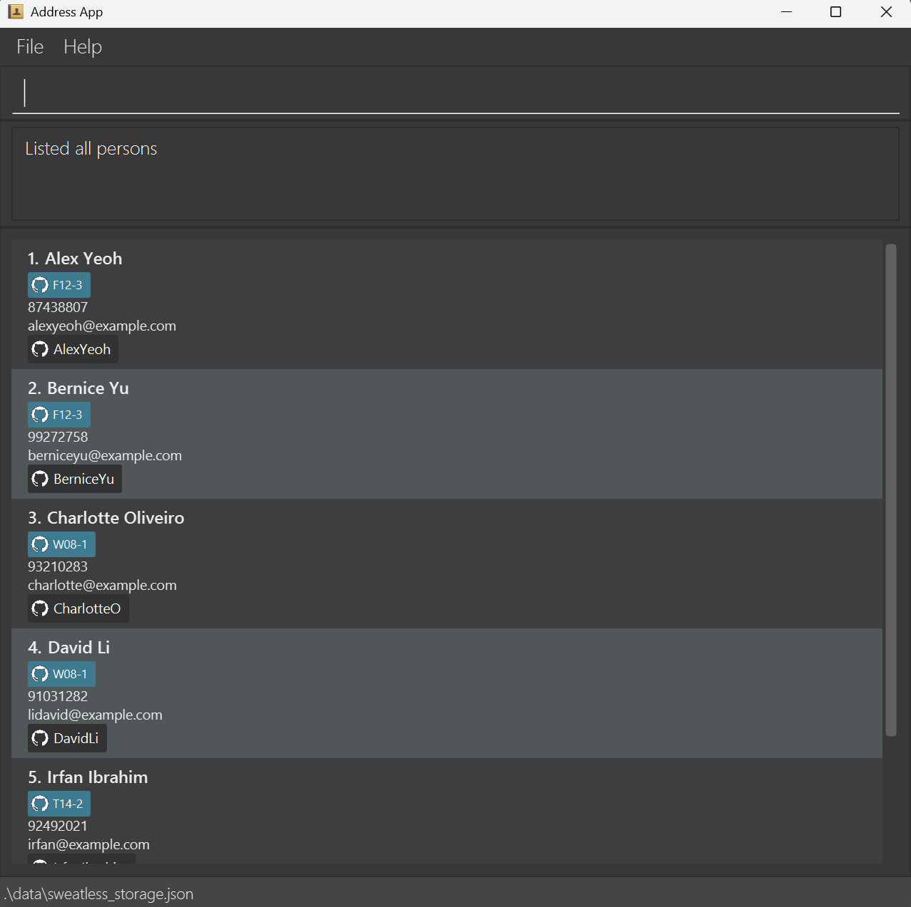
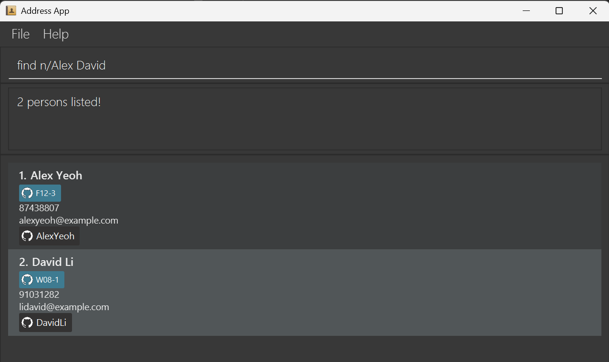

SWEatless is a desktop application for **teaching staff who favour CLI usage** and want to **access and manage student and team information efficiently**.

* Table of Contents
{:toc}

--------------------------------------------------------------------------------------------------------------------

## Command summary

Action | Format, Examples
--------|------------------
**Create Student** | `create_student n/NAME p/PHONE_NUMBER e/EMAIL g/GITHUB_USERNAME​`   e.g., `create_student n/James Ho p/22224444 e/jamesho@example.com g/jamesho`
**Delete Student** | `delete_student INDEX`  e.g., `delete 3`
**Edit Student** | `edit_student INDEX [n/NAME] [p/PHONE_NUMBER] [e/EMAIL] [g/GITHUB_USERNAME]​`  e.g.,`edit_student 2 n/James Lee e/jameslee@example.com`
**Create Team** | `create_team TEAM_NAME`   e.g., `create_team AY2526S1-CS2103T-F12-3`
**Delete Team** | `delete_team TEAM_NAME`  e.g., `delete_team AY2526S1-CS2103T-F12-3`
**Add To Team** | `add_to_team INDEX t/TEAM_NAME`   e.g., `add_to_team 1 t/AY2526S1-CS2103T-F12-3`
**Remove from Team** | `remove_from_team INDEX t/TEAM_NAME`  e.g., `remove_from_team 3 t/AY2526S1-CS2103T-F12-3`
**Find** | `find KEYWORD [MORE_KEYWORDS]`  e.g., `find James Jake`
**List** | `list`
**Clear** | `clear`
**Exit** | `exit`
**Help** | `help`

## Quick start

1. Ensure you have Java `17` or above installed in your Computer. 
   **Mac users:** Ensure you have the precise JDK version prescribed [here](https://se-education.org/guides/tutorials/javaInstallationMac.html).

1. Download the latest `.jar` file from [here](https://github.com/se-edu/addressbook-level3/releases).

1. Copy the file to the folder you want to use as the _home folder_ for SWEatless.

1. Open a command terminal, `cd` into the folder you put the jar file in, and use the `java -jar SWEatless.jar` command to run the application. 
   A GUI similar to the below should appear in a few seconds. Note how the app contains some sample data. 
   

1. Type the command in the command box and press Enter to execute it. e.g. typing **`help`** and pressing Enter will open the help window. 
   Some example commands you can try:

   * `list` : Lists all contacts.

   * `add n/John Doe p/98765432 e/johnd@example.com g/johnd` : Adds a contact named `John Doe` to SWEatless.

   * `delete 3` : Deletes the 3rd contact shown in the current list.

   * `clear` : Deletes all contacts.

   * `exit` : Exits the app.

1. Refer to the [Features](#features) below for details of each command.

--------------------------------------------------------------------------------------------------------------------

## Features

**:information_source: Notes about the command format:** 

* Words in `UPPER_CASE` are the parameters to be supplied by the user. 
  e.g. in `add n/NAME`, `NAME` is a parameter which can be used as `add n/John Doe`.

* Parameters can be in any order. 
  e.g. if the command specifies `n/NAME p/PHONE_NUMBER`, `p/PHONE_NUMBER n/NAME` is also acceptable.

* Extraneous parameters for commands that do not take in parameters (such as `help`, `list`, `exit` and `clear`) will be ignored. 
  e.g. if the command specifies `help 123`, it will be interpreted as `help`.

* If you are using a PDF version of this document, be careful when copying and pasting commands that span multiple lines as space characters surrounding line-breaks may be omitted when copied over to the application.

### Creating a student: `create_student`

Creates a student to add to SWEatless.

Format: `create_student n/NAME p/PHONE_NUMBER e/EMAIL g/GITHUB_USERNAME​`

Examples:
* `create_student n/John Doe p/98765432 e/johnd@example.com g/johnd`
* `create_student n/Betsy Crowe e/betsycrowe@example.com p/97121323 g/betsycrowe`

### Deleting a student : `delete_student`

Deletes the specified student from the address book.

Format: `delete_student INDEX`

* Deletes the student at the specified `INDEX`.
* The index refers to the index number shown in the displayed student list.
* The index **must be a positive integer** 1, 2, 3, …​

Examples:
* `delete_student 1` Deletes the 1st student.

### Editing a student : `edit_student`

Edits an existing student in SWEatless.

Format: `edit_student INDEX [n/NAME] [p/PHONE] [e/EMAIL] [g/GITHUB_USERNAME]`

* Edits the student at the specified `INDEX`. The index refers to the index number shown in the displayed student list. The index **must be a positive integer** 1, 2, 3, …​
* At least one of the optional fields must be provided.
* Existing values will be updated to the input values.

Examples:
*  `edit_student 1 p/91234567 e/johndoe@example.com` Edits the phone number and email address of the 1st student to be `91234567` and `johndoe@example.com` respectively.
*  `edit_student 2 n/Betsy Crower` Edits the name of the 2nd student to be `Betsy Crower`

### Creating a team: `create_team`

Creates a team to add to SWEatless.

Format: `create_team TEAM_NAME`

* `TEAM_NAME` must follow the following format: .

Examples:
* `create_team AY2526S1-CS2103T-F12-3`
* `create_team TEAM-1`

### Deleting a team: `delete_team`

Deletes the specified team from SWEatless.

Format: `delete_team TEAM_NAME`

Examples:
* `delete_team AY2526S1-CS2103T-F12-3`
* `delete_team TEAM-1`

### Locating persons by name: `find`

Finds students whose names contain any of the given keywords.

Format: `find KEYWORD [MORE_KEYWORDS]`

* The search is case-insensitive. e.g `hans` will match `Hans`
* The order of the keywords does not matter. e.g. `Hans Bo` will match `Bo Hans`
* Only the name is searched.
* Only full words will be matched e.g. `Han` will not match `Hans`
* Studentss matching at least one keyword will be returned (i.e. `OR` search).
  e.g. `Hans Bo` will return `Hans Gruber`, `Bo Yang`

Examples:
* `find John` returns `john` and `John Doe`
* `find alex david` returns `Alex Yeoh`, `David Li` 
  

### Listing all students : `list`

Shows a list of all students in SWEatless.

Format: `list`

Examples:
* `list` followed by `delete 2` deletes the 2nd student in SWEatless.
* `find Betsy` followed by `delete 1` deletes the 1st student in the results of the `find` command.

### Clearing all entries : `clear`

Clears all entries from SWEatless.

Format: `clear`

### Exiting the program : `exit`

Exits the program.

Format: `exit`

### Viewing help : `help`

Shows a message explaining how to access the help page.

Format: `help`

### Saving the data

SWEatless data are saved in the hard disk automatically after any command that changes the data. There is no need to save manually.

### Editing the data file

SWEatless data are saved automatically as a JSON file `[JAR file location]/data/addressbook.json`. Advanced users are welcome to update data directly by editing that data file.

:exclamation: **Caution:**
If your changes to the data file makes its format invalid, SWEatless will discard all data and start with an empty data file at the next run. Hence, it is recommended to take a backup of the file before editing it. 
Furthermore, certain edits can cause the SWEatless to behave in unexpected ways (e.g., if a value entered is outside of the acceptable range). Therefore, edit the data file only if you are confident that you can update it correctly.

--------------------------------------------------------------------------------------------------------------------

## FAQ

**Q**: How do I transfer my data to another Computer? 
**A**: Install the app in the other computer and overwrite the empty data file it creates with the file that contains the data of your previous SWEatless home folder.

--------------------------------------------------------------------------------------------------------------------

## Known issues

1. **When using multiple screens**, if you move the application to a secondary screen, and later switch to using only the primary screen, the GUI will open off-screen. The remedy is to delete the `preferences.json` file created by the application before running the application again.
2. **If you minimize the Help Window** and then run the `help` command (or use the `Help` menu, or the keyboard shortcut `F1`) again, the original Help Window will remain minimized, and no new Help Window will appear. The remedy is to manually restore the minimized Help Window.

--------------------------------------------------------------------------------------------------------------------
